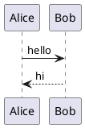
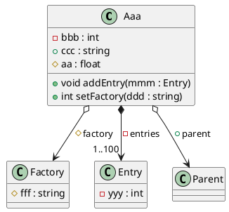

# PlantUML for GitHub

## Sequence Diagram

```plantuml
@startuml
Alice -> Bob: hello
Bob --> Alice: hi
@enduml
```

## Class Diagram

```plantuml
@startuml
class Aaa {
    -bbb : int
    +ccc : string
    #aa : float
    +void addEntry(mmm : Entry)
    +int setFactory(ddd : string)
}
class Factory {
    #fff : string
}
class Entry {
    -yyy : int
}
class Parent {
}
Aaa *--> "1..100" Entry : -entries
Aaa o--> Factory : #factory
Aaa o--> Parent : +parent
@enduml
```
