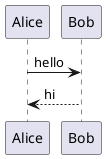

# PlantUML for GitHub

A Chrome extension that renders ` ```plantuml ` code blocks directly on GitHub pages, using the TeaVM-compiled PlantUML engine that runs entirely client-side.

**No server. No tokens. No tracking. Zero permissions.**

## Installation

- From the [Chrome Web Store](https://chromewebstore.google.com/detail/plantuml-for-github/lbokhidfopkdehkmlmpaabacljoediic)


## Live demo

With the extension installed and active, the block below should render as a sequence diagram:



## How it works

1. The extension's content script scans every GitHub page for `plantuml` code blocks.
2. Each block is replaced with a sandboxed `<iframe>` packaged inside the extension.
3. The iframe loads the TeaVM-compiled `plantuml.js` engine and renders the diagram to SVG.
4. The result is displayed inline in the page, inside a small wrapper with a header bar.
5. The header bar shows a **toggle button** (top-left of the wrapper) that switches between the rendered diagram and the original PlantUML source. The source view uses GitHub's own syntax highlighting, so it looks exactly as it would without the extension installed.

This is the same architecture GitHub already uses for Mermaid — proving that client-side PlantUML can be integrated natively with zero infrastructure cost.

## Security & permissions

The extension declares **zero Chrome permissions** (no host permissions, no
storage, no tabs API). It only ships a content script scoped to `github.com`
and a packaged renderer page.

One thing worth calling out is the extension's Content Security Policy. The
Manifest V3 default CSP for extension pages is essentially `script-src 'self'`,
which blocks WebAssembly. We need to relax it slightly:

```json
"content_security_policy": {
  "extension_pages": "script-src 'self' 'wasm-unsafe-eval'; object-src 'self'"
}
```

Why? PlantUML renders sequence diagrams directly to SVG, but anything that
needs graph layout — **class, component, deployment, state, use-case, and
activity diagrams** — is laid out by the embedded **Graphviz engine, which
ships as a WebAssembly module** (`viz-global.js`). Instantiating that module
requires the `'wasm-unsafe-eval'` CSP source.

`'wasm-unsafe-eval'` is a narrowly scoped directive: despite the scary name,
it **only** allows WebAssembly compilation and instantiation. It does **not**
re-enable `eval()` or `new Function()` — those remain blocked. No remote
scripts can be loaded either; `script-src 'self'` still applies. Google
documents this directive as the supported way to ship WASM in MV3 extensions.

In short: the engine runs entirely inside a sandboxed iframe with an opaque
origin, with no network access and no shared state with the host page.

## Testing without a real GitHub page

To test quickly, create a new issue or discussion in any repo you own with this content:

````markdown

````

Save it, then reload the page. The diagram should appear.

## Roadmap

- [x] MVP: detect and render `plantuml` blocks
- [ ] Firefox support (Manifest V3 is now supported in Firefox)
- [ ] "Copy SVG" / "Copy source" buttons
- [x] Theme matching (light/dark) — follows GitHub's color mode
- [x] Support `puml` and `wsd` language aliases
- [ ] Options page (toggle, performance settings)
- [ ] Chrome Web Store publication

## Why this extension exists

PlantUML support on GitHub has been requested for 4+ years:
<https://github.com/orgs/community/discussions/10111>

The main blocker was performance and infrastructure cost. With the TeaVM-compiled engine, **that blocker no longer exists**. This extension demonstrates that PlantUML can run natively on GitHub.com with zero server-side changes — using the exact same sandbox pattern GitHub uses for Mermaid.

If you'd like to see this integrated natively, please **upvote the discussion**:
<https://github.com/orgs/community/discussions/10111>

## Installation for Chrome (developer mode)

### Step 1 — Load the extension in Chrome

1. Open `chrome://extensions/`
2. Toggle **Developer mode** on (top-right)
3. Click **Load unpacked**
4. Select the `plantuml-for-github/` folder

### Step 2 — Test it

Visit any GitHub page containing a ` ```plantuml ` block, for example:

- A README that uses PlantUML
- An issue or PR comment with a `plantuml` fenced block

You should see the diagram rendered inline, with a small "🌱 PlantUML (client-side render)" badge above it. Click the toggle button (the `<>` icon to the left of the badge) to switch to the original source view; click it again (it now shows an eye icon) to switch back to the diagram.


## License

MIT