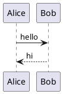

# PlantUML for GitHub

A Chrome extension that renders ` ```plantuml ` code blocks directly on GitHub pages, using the TeaVM-compiled PlantUML engine that runs entirely client-side.

**No server. No tokens. No tracking. Zero permissions.**

## Installation

- From the [Chrome Web Store](https://chromewebstore.google.com/detail/plantuml-for-github/lbokhidfopkdehkmlmpaabacljoediic)
- From the [Firefox Add-ons Catalog](https://addons.mozilla.org/en-US/firefox/addon/plantuml-for-github/)


## Live demo

With the extension installed and active, the block below should render as a sequence diagram:


```plantuml
@startuml
Alice -> Bob: hello
Bob --> Alice: hi
@enduml
```

## How it works

1. The extension's content script scans every GitHub page for `plantuml` code blocks. Blocks with no language marker at all (a languageless ` ``` ` fence, or an AsciiDoc `[plantuml]` listing block, which GitHub renders without the `asciidoctor-diagram` extension) are still recognized, by matching PlantUML's own `@startuml` / `@enduml` delimiters in the text.
2. Each block is replaced with a sandboxed `<iframe>` packaged inside the extension.
3. The iframe loads the TeaVM-compiled `plantuml.js` engine and renders the diagram to SVG.
4. The result is displayed inline in the page, inside a small wrapper with a header bar.
5. The header bar shows a **toggle button** (top-left of the wrapper) that switches between the rendered diagram and the original PlantUML source. The source view uses GitHub's own syntax highlighting, so it looks exactly as it would without the extension installed.

This is the same architecture GitHub already uses for Mermaid — proving that client-side PlantUML can be integrated natively with zero infrastructure cost.

## Security & permissions

The extension declares **zero Chrome permissions** (no host permissions, no
storage, no tabs API). It only ships a content script scoped to `github.com` and `*.ghe.com` (GitHub Enterprise Cloud)
and a packaged renderer page.

The extension also runs under the stock Manifest V3 Content Security Policy
(essentially `script-src 'self'`), with no relaxation at all. Diagrams that
need graph layout (**class, component, deployment, state, and use-case
diagrams**) are laid out by **Smetana**, PlantUML's built-in port of the
Graphviz layout algorithms, which is compiled into the same `plantuml.js`
file as the rest of the engine. There is no WebAssembly module and no
`'wasm-unsafe-eval'` directive in the manifest.

This matters beyond the extension itself: GitHub serves its own Mermaid
renderer under a `script-src 'self'` CSP that blocks WebAssembly, so an
engine that needs WASM could never be adopted natively. This one runs as a
single JavaScript file under exactly that policy.

In short: the engine runs entirely inside a sandboxed iframe with an opaque
origin, with no network access and no shared state with the host page.

## Testing without a real GitHub page

To test quickly, create a new issue or discussion in any repo you own with this content:

````markdown

```plantuml
@startuml
Alice -> Bob: hello
Bob --> Alice: hi
@enduml
```
````

Save it, then reload the page. The diagram should appear.

## Roadmap

- [x] MVP: detect and render `plantuml` blocks
- [X] Firefox support (Manifest V3 is now supported in Firefox)
- [X] "Copy SVG" / "Copy source" buttons
- [x] Theme matching (light/dark) — follows GitHub's color mode
- [x] Support `puml` and `wsd` language aliases
- [x] Detect untagged / AsciiDoc `[plantuml]` blocks via `@startuml`/`@enduml` sniffing
- [ ] Options page (toggle, performance settings)
- [X] Chrome Web Store publication

## Why this extension exists

PlantUML support on GitHub has been requested for 4+ years:
<https://github.com/orgs/community/discussions/10111>

The main blocker was performance and infrastructure cost. With the TeaVM-compiled engine, **that blocker no longer exists**. This extension demonstrates that PlantUML can run natively on GitHub.com with zero server-side changes — using the exact same sandbox pattern GitHub uses for Mermaid.

If you'd like to see this integrated natively, please **upvote the discussion**:
<https://github.com/orgs/community/discussions/10111>

## Installation for Chrome (developer mode)

### Step 1 — Load the extension in Chrome

1. Open `chrome://extensions/`
2. Toggle **Developer mode** on (top-right)
3. Click **Load unpacked**
4. Select the `plantuml-for-github/` folder

### Step 2 — Test it

Visit any GitHub page containing a ` ```plantuml ` block, for example:

- A README that uses PlantUML
- An issue or PR comment with a `plantuml` fenced block

You should see the diagram rendered inline, with a small "🌱 PlantUML (client-side render)" badge above it. Click the toggle button (the `<>` icon to the left of the badge) to switch to the original source view; click it again (it now shows an eye icon) to switch back to the diagram.


## License

MIT